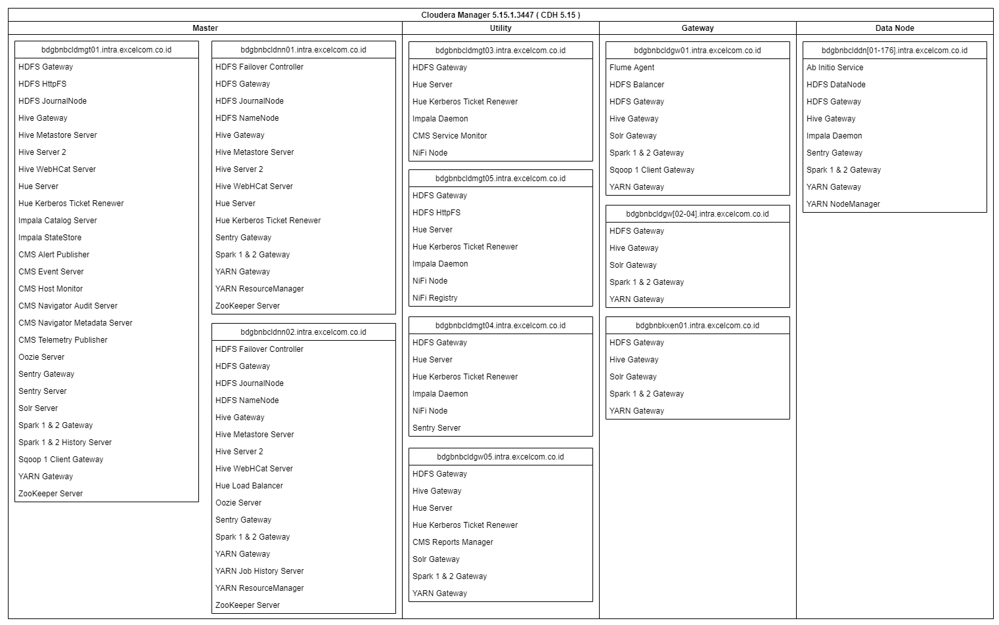

# Cloudera
## Roles Layout
Following is service roles layout on cluster **bdgbnbcld-Prod**


# Web Locations
| URL                                                                  | Description | Notes                              |
|----------------------------------------------------------------------|-------------|------------------------------------|
| https://secure.xl.co.id                                              | VPN         |                                    |
| http://xl-idm-portal.intra.excelcom.co.id:14000/identity/faces/home  | IDM         |                                    |
| https://webmail.xl.co.id/                                            | Webmail XL  | User & password Active Directory   |
| http://bdgbnbcldgw01.intra.excelcom.co.id:45311                      | Jupyter     | Password: voyager2021              |
| http://bdgbnbcldnn02.intra.excelcom.co.id:8889                       | HUE         | User & password Active Directory   |
| http://gitrepo.xlaxiata.id                                           | GIT         | User & password Active Directory   |
| http://cbtcnbwebproxy.intra.excelcom.co.id:80                        | Proxy       |                                    |
| http://bdgbnbcldmgt01:7180                                           | CM Datalake | User: cld_readonly, Pass: P@ssw0rd |
| http://bdgcldmgtv22:7180                                             | CM Stream   | User: cld_readonly, Pass: P@ssw0rd |

# Hosts
| Host                                | IP           | Description                        |
|-------------------------------------|--------------|------------------------------------|
| bdgbnbcldmgt01.intra.excelcom.co.id | 10.24.246.23 | CM, Impala LB, HiveServer2, HttpFS |
| bdgbnbcldnn01.intra.excelcom.co.id  | 10.24.246.21 | Name Node, HiveServer2             |
| bdgbnbcldnn02.intra.excelcom.co.id  | 10.24.246.22 | Name Node, HiveServer2             |
| cbtcnbbcaapp02.intra.excelcom.co.id | 10.23.55.23  | Remote desktop                     |
| bdgbnbcldgw01.intra.excelcom.co.id  | 10.24.246.24 | Edge node 1                        |
| bdgbnbcldgw02.intra.excelcom.co.id  | 10.24.246.76 | Edge node 2                        |

# Port Slot
| Team | User                          | Slot Port   |
|------|-------------------------------|-------------|
| ACE  | aceid, ampid, xqi.rizqil, etc | 4300 - 4399 |
| REVA | revaid, etc                   | 4200 - 4200 |
| ACM  | acmid, etc                    | 4100 - 4199 |

Only for jobs run on gw01


# Shell
## Impala
```impala-shell -i bdgbnbcldmgt01.intra.excelcom.co.id -d default -k```

## Hive
```beeline -u "jdbc:hive2://bdgbnbcldmgt01.intra.excelcom.co.id:10000/default;principal=hive/bdgbnbcldmgt01.intra.excelcom.co.id@INTRA.EXCELCOM.CO.ID"```

# Kerberos
## Create keytab file
To create keytab file on a server
1. SSH to the server
2. Execute this command to enter keytab utility<br/> ```ktutil```
3. Execute this command to create a new entry on keytab<br/> ```add_entry -password -p xqi.nama -k 0 -e arcfour-hmac```<br/>(username must be UPPERCASE)
4. Execute this command to write keytab to a new file<br/> ```write_kt xqi.nama.keytab```
5. Execute this command to exit keytab utility<br/> ```quit```
6. Check generated keytab file using<br/> ```ls -l xqi.nama.keytab```
7. If you already have kerberos ticket, destroy kerberos ticket cache using<br/> ```kdestroy```
8. Initiate kerberos ticket using<br/> ```kinit -kt xqi.nama.keytab xqi.nama```
9. Check kerberos ticket cache using<br/> ```klist```

# HDFS
Name Service: ```nameservice1``` (not needed)

Example of full URL HDFS: **hdfs:///tmp**

# Spark
Application version used on Spark
| App    | Version         |
|--------|-----------------|
| Spark  | 2.4.0.cloudera2 |
| Scala  | 2.11.12         |
| JDK    | 1.8.0_144       |
| Python | 2.7.5; 3.5.5    |
| Conda  | 4.5.11          |
